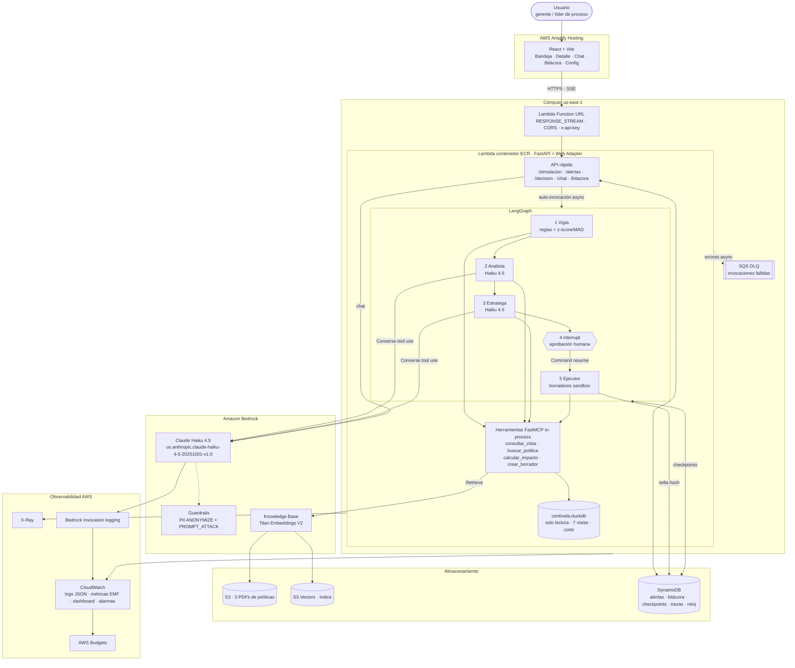
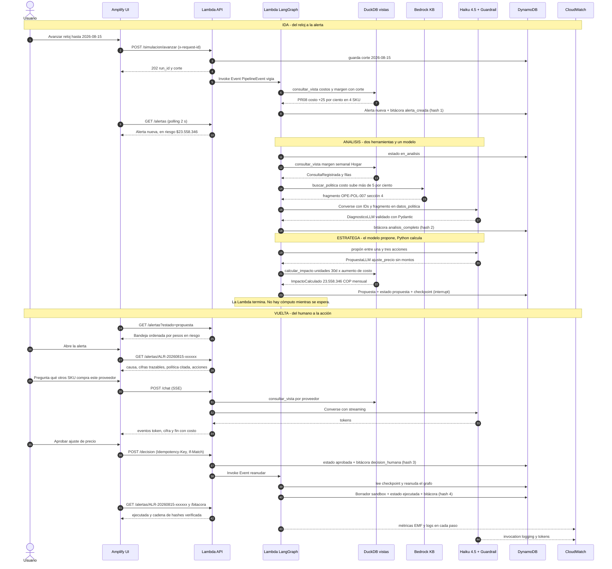
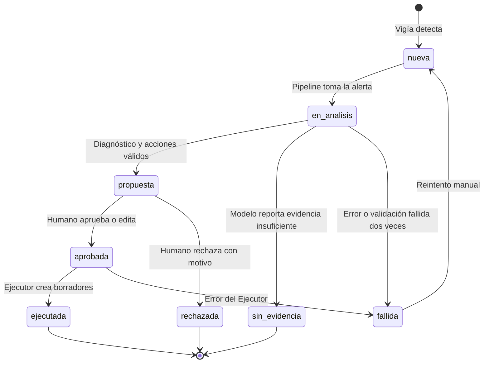
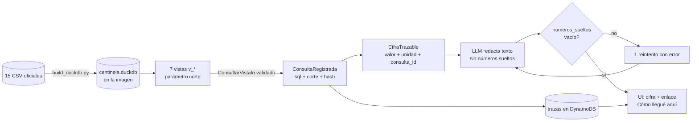
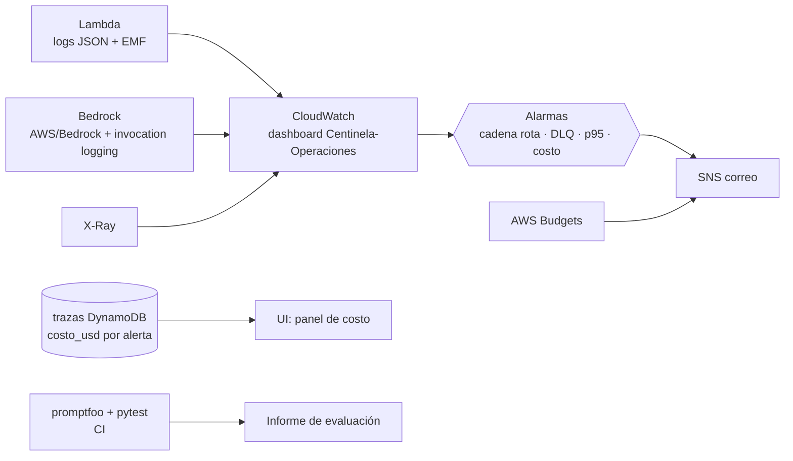

# 04 · Diagramas de arquitectura y flujo de información

Diagramas Mermaid (se renderizan en GitHub, VS Code y la mayoría de visores). Contratos de cada flecha: [03_contratos_datos.md](03_contratos_datos.md).

## 1. Arquitectura completa

## 2. Flujo de información ida y vuelta: escenario real S1 (margen de Hogar)

Datos reales: el 2026-08-15 el proveedor `PR08` sube **+25 %** el costo de `P0001`, `P0006`, `P0011` y `P0021` sin cambio en la lista de precios. Impacto calculado con las unidades de los 30 días previos × aumento de costo: **$23.558.346 COP/mes**.

## 3. Ciclo de vida de una alerta

## 4. Linaje de una cifra (de CSV a pantalla)

## 5. Observabilidad y control de costo

